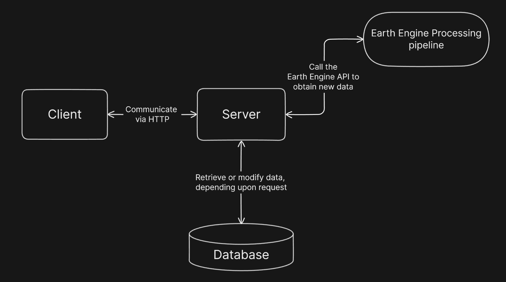
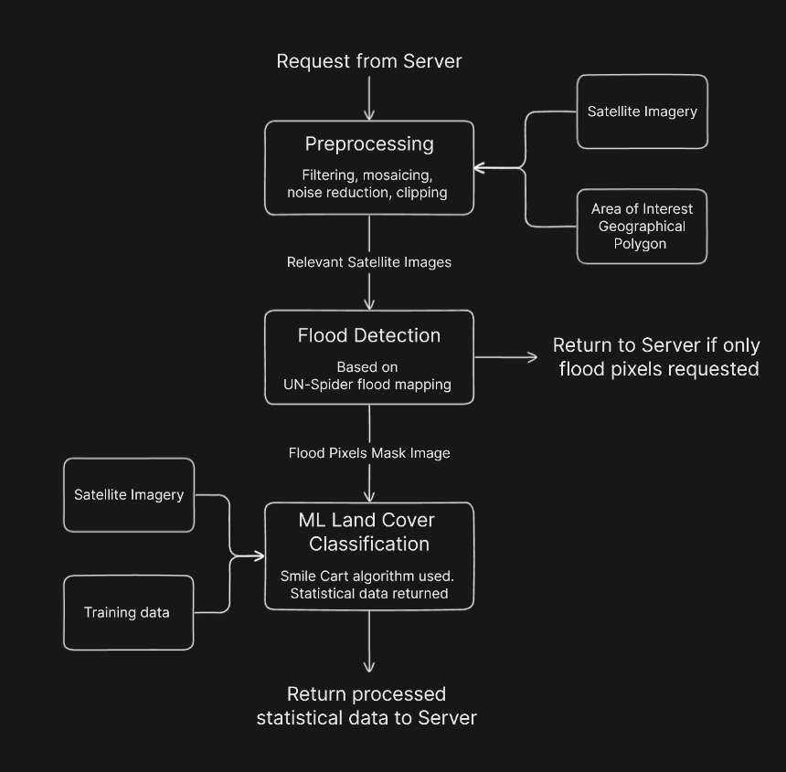

<p align="center">
  
</p>

<h1 align="center">
  Flood Tracker
</h1>

<p align="center">
  An interactive web app for flood tracking and analysis, built with the MERN Stack, and employing machine learning and computer vision to provide environmental insights and damage assessments.
</p>

<p align="center">
  <a href="https://flood-tracker.onrender.com/">
    
  </a>
</p>
<!-- Flood Tracker is a full-stack application designed to monitor and analyze flood data in real-time. Utilizing the power of the MERN stack, along with the Google Earth Engine API, this application processes satellite images to extract vital statistics about flood-affected areas. It offers insights into the impact on urban areas, farmlands, and road networks -->

## Basic Overview

Flood Tracker was born out of a pressing need to address challenges posed by climate change, particularly natural disasters such as floods. As extreme weather events become more frequent and severe, it is essential to have robust and reliable solutions for tracking and understanding flood situations. This app aims to meet that demand by leveraging cutting-edge technology to provide accurate, timely data that can aid in effective disaster management and documentation.

The application operates by integrating the Earth Engine API to fetch satellite data, which is then processed using a custom flood detection algorithm. It also employs machine learning to classify land covers, helping to estimate the impact of floods on different land types. The frontend, developed using React, presents this data in an interactive, user-friendly dashboard, making it an invaluable tool for disaster management.

<!-- perhaps add a link to 'learn more' -->

### Features

- 🌍 **Satellite Flood Tracking**: Monthly updates using satellite data.
- 🌱 **ML Land Classification**: Identifies affected agricultural, urban, and road areas.
- 🗺️ **Interactive Maps**: Google Maps integration for data visualization.
- 📊 **React Dashboard**: User-friendly interface for intuitive data display.
- 🔒 **Secure Access Admin Panel**: Control panel for API and data management, protected with JWT authentication.
- 🎨 **Sleek UI**: Styled with Tailwind CSS and Material UI.

## How It Works

This section provides a high-level overview of the application's workflow. It is designed to give you a clear understanding of how the various components of the application interact with each other, from initial client requests to data processing and visualization. The Earth Engine processing pipeline will be discussed separately from the Client-Server Interaction.

### Application Flow:

The core of the application is the interaction between the client and the server. The server acts as buffer in order to decouple data retrieval from lengthy data processing. Below is a flowchart that illustrates this process.

<p align="center">
  
</p>

<!-- The client initiates the process by making a request over HTTP to the server. Depending on the nature of the request, the server either retrieves pre-processed data from the database or, if required, makes a call to the Earth Engine API to fetch or update the data. This could be triggered by the client or by a scheduled task, such as a monthly cron job. For operations that require real-time data, such as acquiring flood pixel map IDs, the server acts as an intermediary to ensure data security and integrity. It's important to note that administrative tasks, such as data management, are secured through JWT authentication, allowing only authorized admin users to access these features. -->

**Client-Server Interaction:**

- Clients request data via HTTP; the server either fetches from the database or requests fresh data from the Earth Engine Processing Pipeline.
- Data processing is decoupled from retrieval, with asynchronous server-side processing for efficiency.
- A monthly cron job ensures regular data refreshes.

**Earth Engine API Interaction:**

- Server requests Earth Engine API processing with specific parameters, storing returned data for rapid access.

**Database Storage:**

- The database securely stores processed data and user credentials, enabling efficient data retrieval and admin management.

**Admin Control Panel and Authentication:**

- Admins use JWT authentication for control panel access, managing data and overseeing server-API interactions.

### Earth Engine Processing Pipeline

As previously mentioned, the Earth Engine API plays a crucial role in data processing. Let's explore this in the following flowchart.

<p align="center">
  
</p>

**Preprocessing:**

- Retrieves images from Sentinel-1 SAR dataset based on date and location.
- Acquires administrative polygons for region-specific processing.
- Filters and mosaics images to represent the target area.

**Flood Detection:**

- Applies speckle filtering to smoothen images.
- Compares pre-flood and current images to identify flooded pixels using brightness thresholds.
- Creates a mask from flood-identified pixels, refining it against known water bodies datasets.

**Land Cover Classification:**

- Uses images from Sentinel-2 SAR for detailed land analysis.
- Integrates road datasets and labeled training data for classification.
- Smile Cart classifier categorizes land, comparing before-and-after images for damage assessment.

<br/>

This overview outlines the fundamental operations of the application. While it captures the essence of the app's functionality, each component is built on complex and sophisticated technology designed to provide reliable and timely flood data.

## Installing and running Flood Tracker

Clone the repository to your local machine by running the following command in your terminal:

```
git clone https://github.com/AbsharHassan/flood-tracker-app.git

cd flood-tracker-app
```

**Environment Variables:**

Before installation, you'll need to set up the following environment variables. Here's a table outlining each one and where to obtain them:

| Variable Name                   | Description                         | How to Obtain                                                                                                                                         |
| ------------------------------- | ----------------------------------- | ----------------------------------------------------------------------------------------------------------------------------------------------------- |
| `MONGO_URI`                     | MongoDB connection URI.             | Follow steps at [MongoDB Basics](https://www.mongodb.com/basics/create-database) to create a database and obtain the URI.                             |
| `JWT_SECRET`                    | Secret key for JWT authentication.  | Generate a random string using tools like [RandomKeygen](https://randomkeygen.com/).                                                                  |
| `ACCESS_TOKEN_SECRET`           | Secret for access token in JWT.     | Generate a random string, preferably different from `JWT_SECRET`, using [RandomKeygen](https://randomkeygen.com/).                                    |
| `REFRESH_TOKEN_SECRET`          | Secret for refresh token in JWT.    | Generate another unique random string using [RandomKeygen](https://randomkeygen.com/).                                                                |
| `EE_PRIVATE_KEY`                | API key for Earth Engine.           | Obtain by following instructions at [Earth Engine App Key](https://developers.google.com/earth-engine/guides/app_key#obtaining-an-api-key).           |
| `REACT_APP_GOOGLE_MAPS_API_KEY` | Google Maps API key (for frontend). | Get the API key by following steps at [Google Maps API Key](https://developers.google.com/maps/documentation/javascript/get-api-key#create-api-keys). |

Make sure to add `REACT_APP_GOOGLE_MAPS_API_KEY` in the `.env` file within your **frontend** folder, and the rest in the root folder `.env` file.

**Starting up the server:**

Once the environment variables are set up, go ahead and install the dependencies and start the server:

```
npm install

npm run server
```

This will install all the backend dependencies and start up the server on port `5000`.

**Starting up frontend app:**

After making sure you have created the required `.env` file in the `frontend` folder, open up another terminal and run the following to install dependencies and start the app:

```
cd frontend

npm install

npm run start
```

This will install all the `frontend` dependencies and launch your React app in development mode on port `3000`.

You can also create an optimized production build for your React app by running the following command in a terminal inside the `frontend` folder:

```
npm run build
```

**Running the server and React app concurrently:**

If you wish to run the server and React app in the same terminal, you can do so by running the following command in the root of application:

```
npm run dev
```

This will start up both the server and React app in the same terminal. Make sure you have all required environment variables set up and dependencies installed.

## Future Enhancements

This is the first iteration of Flood Tracker. The application will continue to grow. Here are some of the planned enhancments and new features:

- **AI-Based Prediction Feature**: Introducing an AI-based predictive model that utilizes NASA's datasets and other APIs to forecast potential flooding events. This feature will aim to identify areas more vulnerable to flooding based on historical data, enhancing proactive measures and preparedness.

- **Improved Data Accuracy**: Implementing advanced algorithms for more precise flood detection and land classification.

- **Expanded Geographic Coverage**: Extending the application’s capabilities to cover more regions and countries.

- **More Frequent Data Updates**: Upgrading the system to release more frequent updates.

- **API Development**: Creating a public API for wider access to Flood Tracker’s data and services.
